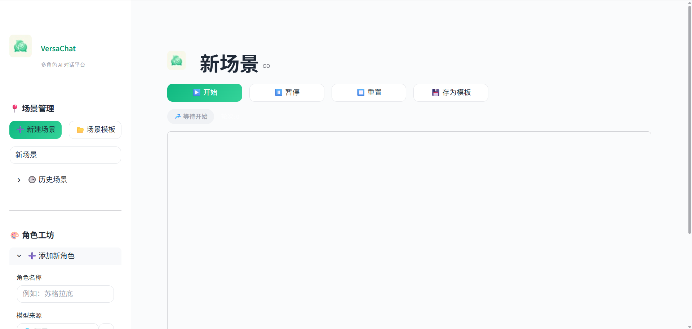

# VersaChat - 多角色 AI 对话平台

<p align="center">
  
</p>

<p align="center">
  <strong>🎭 让多个 AI 角色在同一场景中自由对话</strong>
</p>

<p align="center">
  <a href="#特性">特性</a> •
  <a href="#快速开始">快速开始</a> •
  <a href="#使用指南">使用指南</a> •
  <a href="#架构设计">架构设计</a> •
  <a href="#配置说明">配置说明</a> •
  <a href="#贡献指南">贡献指南</a>
</p>

---

## ✨ 特性

- 🎭 **多角色对话** - 创建多个 AI 角色，设定独特人格，让它们在场景中自由交流
- 🔌 **多模型支持** - 支持 DashScope (Qwen)、OpenAI、Anthropic Claude、Ollama 本地模型
- 💬 **旁白引导** - 通过旁白控制剧情走向，像导演一样掌控对话节奏
- 📝 **场景模板** - 内置丰富场景模板，快速启动历史辩论、商业讨论等主题
- 💾 **会话持久化** - 自动保存对话进度，随时继续未完成的对话
- 🎨 **清新 UI** - 简洁优雅的薄荷绿主题，专业的用户体验
- 🧠 **智能上下文** - 基于 Token 的智能截断，动态管理对话上下文
- 🔄 **自动重试** - API 调用失败自动重试，支持指数退避

## 📸 截图

<p align="center">
  
</p>

## 🚀 快速开始

### 环境要求

- Python 3.9+
- pip 包管理器

### 安装步骤

1. **克隆仓库**

```bash
git clone https://github.com/yourusername/VersaChat.git
cd VersaChat
```

2. **安装依赖**

```bash
pip install -r requirements.txt
```

3. **配置 API Key** (可选)

创建 `.env` 文件并添加你的 API Key：

```env
# 阿里 DashScope
DASHSCOPE_API_KEY=your_dashscope_key

# OpenAI
OPENAI_API_KEY=your_openai_key
OPENAI_BASE_URL=https://api.openai.com/v1

# Anthropic Claude
ANTHROPIC_API_KEY=your_anthropic_key

# Ollama 本地服务
OLLAMA_URL=http://localhost:11434
```

4. **启动应用**

```bash
streamlit run app.py
```

5. 访问 `http://localhost:8501` 开始使用

## 📖 使用指南

### 创建角色

1. 在侧边栏「角色工坊」中点击「+ 添加角色」
2. 输入角色名称（如"苏格拉底"）
3. 选择模型来源和具体模型
4. 编写人格设定，描述角色的性格、背景、说话风格
5. 点击「✨ 添加角色」

### 开始对话

1. 添加至少 2 个角色
2. 可选：从「📂 场景模板」选择预设场景
3. 点击「▶️ 开始」按钮
4. 角色会轮流发言，你可以通过「💬 旁白」引导对话方向

### 使用旁白

旁白功能让你像导演一样控制剧情：

```
示例旁白：
- "话题转向了经济问题..."
- "突然，一位新来者打断了讨论..."
- "请各位就AI伦理问题发表看法。"
```

### 管理会话

- **暂停/继续** - 随时暂停对话，稍后继续
- **重置** - 清空当前对话历史
- **历史场景** - 在侧边栏查看和加载之前的对话
- **导出** - 将对话导出为 Markdown 或 JSON

## 🏗️ 架构设计

```
VersaChat/
├── app.py                 # Streamlit 主应用
├── llm_backend.py         # LLM 接口层（多平台支持）
├── context_manager.py     # 上下文管理（Token估算、智能截断）
├── config_manager.py      # 配置管理（API Key、用户偏好）
├── session_manager.py     # 会话管理（持久化、加载）
├── templates.py           # 场景模板管理
├── requirements.txt       # Python 依赖
├── .env                   # 环境变量配置
├── static/                # 静态资源
│   └── logo.png          # 应用 Logo
├── config/                # 用户配置存储
├── saved_sessions/        # 会话存档
└── templates/             # 自定义模板
```

### 上下文管理机制

VersaChat 实现了智能的上下文管理系统：

1. **Token 估算** - 混合中英文智能估算，中文约 1.3 字符/token
2. **动态窗口** - 根据模型上下文限制自动截断历史
3. **角色记忆** - 增强型 System Prompt，防止角色"失忆"
4. **消息分类** - 正确区分 assistant/user/narrator 角色

### 支持的模型

| 平台 | 模型示例 | 上下文长度 |
|------|---------|-----------|
| DashScope | qwen-max, qwen-plus, qwen-turbo | 6K-30K |
| OpenAI | gpt-4o, gpt-4-turbo, gpt-3.5-turbo | 8K-128K |
| Anthropic | claude-3-5-sonnet, claude-3-opus | 200K |
| Ollama | llama3, mistral, qwen2 | 根据模型 |

## ⚙️ 配置说明

### API Key 配置优先级

1. **用户配置** (UI 中输入) - 最高优先级，加密存储
2. **环境变量** (.env 文件)
3. **系统预置** - 默认值

### 多用户隔离

VersaChat 支持多用户同时使用：

- 每个浏览器会话有独立的 `user_id`
- 配置和历史记录按用户隔离
- 会话文件以用户前缀命名

## 🛠️ 开发指南

### 添加新的 LLM 平台

1. 在 `llm_backend.py` 中创建新的接口类，继承 `BaseLLMInterface`
2. 实现 `chat()` 和 `test_connection()` 方法
3. 在 `ModelInterface._create_interface()` 中注册
4. 在 `config_manager.py` 中添加配置支持

### 创建场景模板

可以通过 UI 的「💾 存为模板」功能保存当前场景，或手动在 `templates/` 目录创建 JSON 文件。

## 🤝 贡献指南

欢迎贡献！请遵循以下步骤：

1. Fork 本仓库
2. 创建特性分支 (`git checkout -b feature/AmazingFeature`)
3. 提交更改 (`git commit -m 'Add some AmazingFeature'`)
4. 推送到分支 (`git push origin feature/AmazingFeature`)
5. 开启 Pull Request

### 代码规范

- 使用 Python 类型注解
- 遵循 PEP 8 风格指南
- 为新功能添加适当的注释

## 📄 许可证

本项目采用 MIT 许可证 - 查看 [LICENSE](LICENSE) 文件了解详情。

## 🙏 致谢

- [Streamlit](https://streamlit.io/) - 优雅的 Python Web 框架
- [DashScope](https://dashscope.aliyun.com/) - 阿里云 AI 平台
- [OpenAI](https://openai.com/) - GPT 系列模型
- [Anthropic](https://anthropic.com/) - Claude 系列模型
- [Ollama](https://ollama.ai/) - 本地 LLM 运行框架

---

<p align="center">
  Made with ❤️ by VersaChat Team
</p>
